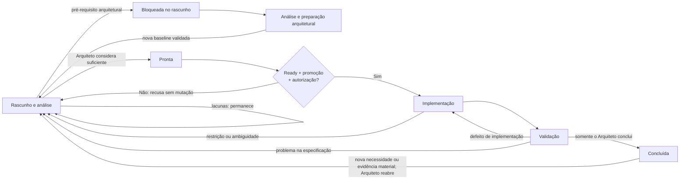

# EKOM Guidelines

**Modelo EKOM vigente:** 3.5

**Estado:** aprovado e vigente

Engineering Knowledge Orchestration Model (EKOM) é um modelo experimental de
orquestração de engenharia no qual a especificação governa a execução dos
agentes de IA, enquanto o Arquiteto mantém autoridade sobre decisões, riscos,
validação e conclusão do workflow.

Seu objetivo operacional é permitir que uma solução seja especificada,
implementada, documentada e entregue sem que o Arquiteto precise executar
diretamente o desenvolvimento. Agentes podem assumir amplamente a execução; o
Arquiteto preserva julgamento, prioridade, responsabilidade e autoridade.

> **Specifications orchestrate. Code implements.**

O EKOM sucede a formulação Engineering Knowledge Model (EKM) 1.x. O nome EKM,
os identificadores `EKM-CHG` e `EKM-GAP` e os registros de experimentos
anteriores são preservados como história e compatibilidade. A mudança de nome
está registrada no [`ADR-0001`](docs/adr/ADR-0001-EKM-TO-EKOM.md); a revisão
operacional 3.0 está no
[`ADR-0002`](docs/adr/ADR-0002-EKOM-3-OPERATIONAL-AUTHORITY.md); o roteamento
documental 3.1, no
[`ADR-0003`](docs/adr/ADR-0003-DOCUMENT-ROUTING-AND-EVIDENCE-SEPARATION.md); as
visões do mapa 3.2, no
[`ADR-0004`](docs/adr/ADR-0004-KNOWLEDGE-MAP-VISUAL-STRUCTURE.md); e o confronto
de autoridade na autoria 3.3, no
[`ADR-0005`](docs/adr/ADR-0005-SPECIFICATION-AUTHORITY-CONFRONTATION.md).
A contenção de escopo funcional e os pré-requisitos arquiteturais 3.4 estão na
[`ADR-0006`](docs/adr/ADR-0006-SPECIFICATION-SCOPE-AND-ARCHITECTURAL-PREREQUISITES.md).
Os gates não implícitos de implementação 3.5 estão na
[`ADR-0007`](docs/adr/ADR-0007-NON-IMPLICIT-IMPLEMENTATION-GATES.md).

O EKOM deve começar pequeno. Governança é útil quando acelera decisões, reduz
retrabalho ou aumenta confiança; não quando apenas multiplica documentos,
agentes ou passagens operacionais.

## Princípios da versão 3.5

- A especificação é a fonte da verdade, nasce antes do código e possui ciclo de
  vida próprio.
- Antes da prontidão, o Autor confronta a mudança com as autoridades normativas
  dos elementos afetados e torna relações ou conflitos explícitos.
- Implementabilidade é avaliada dentro da baseline e do recorte; capacidade
  arquitetural ausente, independente e transversal bloqueia a funcionalidade e
  é preparada separadamente.
- Análise `Ready`, promoção registrada e autorização da mesma versão são gates
  cumulativos; ordem de implementação não substitui condição ausente.
- Conhecimento, decisões e evidências permanecem persistentes, rastreáveis e
  evolutivos.
- Agentes de IA podem investigar, implementar, verificar, documentar e produzir
  evidências dentro do recorte autorizado.
- O Arquiteto é a autoridade final sobre arquitetura, risco aceitável,
  relevância das críticas, suficiência das evidências, aprovação e conclusão ou
  reabertura do workflow.
- Análise de implementabilidade é obrigatória; segregação em um Engenheiro
  Analista separado não é.
- Challenge e revisão são capacidades consultivas acionadas quando o risco ou o
  Arquiteto justificarem uma segunda perspectiva.
- Testes automatizados são evidências, não prova absoluta; sua exigência e a
  combinação de evidências são proporcionais ao risco e ao valor.
- A IA amplia a capacidade do Arquiteto; não o substitui.

Os princípios normativos completos estão em
[`docs/PRINCIPLES.md`](docs/PRINCIPLES.md).

## Workflow governado pela especificação



A especificação governa o fluxo e pode avançar ou retornar conforme o trabalho
produz conhecimento. Os agentes executam e registram evidências; retornos não
representam necessariamente fracasso, mas aprendizado controlado. O Arquiteto
decide as transições relevantes e é o único que determina conclusão ou
reabertura. A fonte Mermaid reutilizável está em
[`diagrams/ekom-specification-lifecycle.mmd`](diagrams/ekom-specification-lifecycle.mmd).

## Capacidades e responsabilidades

| Participante ou capacidade | Responsabilidade |
|---|---|
| Arquiteto | decidir arquitetura, prioridade, risco aceitável, relevância das críticas, suficiência das evidências, aprovação, conclusão e reabertura |
| Autor da Especificação | investigar repositório e arquitetura, confrontar autoridades afetadas e transformar intenção em contrato implementável e verificável |
| Análise de implementabilidade | registrar evidências, impactos, restrições, incertezas, experimentos e bloqueadores; classificar prontidão, defeito funcional, pré-requisito arquitetural, evidência requerida, conflito de restrição ou impacto não delimitado |
| Implementador | verificar os três gates, recusar sem mutação quando algum faltar e, quando satisfeitos, implementar e registrar evidências conforme a especificação |
| Crítico ou Revisor | oferecer challenge consultivo, sem autoridade para aprovar, reprovar, redefinir aceite ou reabrir decisões sem nova evidência |

Uma segunda perspectiva é especialmente valiosa em segurança, autorização,
corrupção de dados, concorrência, operações irreversíveis, falhas recorrentes ou
mudanças de alto risco. Ela não é presumida independente apenas por vir de
outro agente com capacidades, contexto ou vieses semelhantes. O crítico pode
concluir honestamente que não encontrou risco adicional relevante.

O Consultor de Arquitetura é um papel institucional de apoio transversal,
subordinado ao Arquiteto, e não uma autoridade paralela.

## Validação baseada em evidências

Testes são especialmente valiosos para regressões, regras complexas, casos
limítrofes, segurança e contratos estáveis. Não devem ser alterados apenas para
produzir resultado verde, nem usados pelo Implementador como argumento
autorreferente de correção.

Conforme o contexto, a aceitação pode combinar código e diffs, builds, execução
em ambiente real, logs, testes, integração com hardware, APIs, bancos e
infraestrutura, relatórios dos atores, decisões do Arquiteto e defeitos
encontrados posteriormente. Em firmware e integrações, evidência no ambiente
real pode ter precedência funcional sobre testes isolados. O Arquiteto decide
se o conjunto é suficiente e qual risco residual aceita.

## Aprendizado experimental contínuo

As hipóteses da EKOM são continuamente confrontadas com experimentos reais.
Teorias, papéis e mecanismos podem ser confirmados, ajustados ou refutados
conforme evidências materiais produzidas pelos workflows. A EKOM não trata suas
premissas como dogmas: seu próprio modelo faz parte do objeto de aprendizado.

O histórico preserva tanto resultados positivos quanto falhas, custos,
limitações e defeitos posteriores. A evolução do modelo permanece rastreável em
ADRs, decisões de desenho, histórico experimental e Git, sem reinterpretar
retroativamente experimentos executados sob versões anteriores.

## Fluxo de desenvolvimento ponta a ponta

O diagrama abaixo mostra o caminho de uma funcionalidade da User Story até a
integração na referência de produção, com os pontos de decisão e os retornos.
A fonte está em
[`diagrams/flow-ekom-end-to-end.mmd`](diagrams/flow-ekom-end-to-end.mmd).

```mermaid
flowchart LR
    US["Analista de Negócio<br/>User Story com as funcionalidades"] --> ARQ

    subgraph ARQFASE["Arquiteto"]
        ARQ["Analisa a User Story"]
        ARQ --> ARQD{"Há dúvidas ou<br/>pendências?"}
        ARQD -- "Sim" --> ARQN["Trata com o Negócio<br/>esclarecimentos e apoio"]
        ARQN --> ARQ
    end

    ARQD -- "Não" --> AUTOR

    subgraph AUTFASE["Autor da Especificação"]
        AUTOR["Especifica no modelo EKOM<br/>o que implementar no repositório"]
        AUTOR --> AUTFIM["Encerra a autoria<br/>e submete à análise"]
    end

    AUTFIM --> ANALISTA

    subgraph ANAFASE["Engenheiro Analista<br/>agente de IA ou o próprio Arquiteto"]
        ANALISTA["Análise de Implementabilidade"]
        ANALISTA --> ANAD{"Classificação principal?"}
    end

    ANAD -- "Defeito da especificação" --> AUTOR
    ANAD -- "Evidência requerida" --> EVID["Experimento ou evidência<br/>autorizada"]
    EVID --> ANALISTA
    ANAD -- "Pré-requisito arquitetural<br/>ou impacto não delimitado" --> ARQPREP["Arquiteto decide análise,<br/>ADR e preparação"]
    ARQPREP --> PREP["Especificação preparatória<br/>implementada e validada"]
    PREP --> AUTOR
    ANAD -- "Conflito de restrição" --> ARQ
    ANAD -- "Ready" --> IMPL

    subgraph IMPFASE["Engenheiro Implementador"]
        IMPL["Implementa o código"]
        IMPL --> BUILD["Executa builds"]
        BUILD --> TEST["Executa testes,<br/>quando aplicáveis"]
        TEST --> IMPFIM["Submete ao<br/>Tech Lead / Revisor"]
    end

    IMPFIM --> REV

    subgraph REVFASE["Tech Lead / Engenheiro Revisor"]
        REV["Revisa toda a implementação"]
        REV --> REVD{"Está de acordo?"}
    end

    REVD -- "Não: ajustes na<br/>implementação" --> IMPL
    REVD -- "Sim" --> PR["Abre PR do repositório"]
    PR --> DEV["Integra na<br/>branch de desenvolvimento"]

    DEV --> VAL["Validação pelo Desenvolvedor<br/>e pelo Analista de Negócio"]
    VAL --> VALD{"Tudo de acordo?"}
    VALD -- "Não: problemas<br/>de especificação" --> AUTOR
    VALD -- "Sim" --> HOM["Homologação"]

    HOM --> HOMD{"OK da área<br/>responsável?"}
    HOMD -- "Não" --> AUTOR
    HOMD -- "Sim" --> MAIN["Integra na branch main"]
    MAIN --> FIM["Especificação encerrada<br/>Done"]
```



Resultados não prontos não avançam o estado: defeito funcional retorna ao
Autor; evidência requerida volta à análise depois da execução autorizada;
pré-requisito ou impacto não delimitado retorna ao Arquiteto para preparação;
conflito de restrição exige novo desenho ou decisão. Achados de revisão voltam
ao Implementador. A integração na referência de produção permanece autorizada
por decisão humana.

## Responsabilidades das fontes

```text
Especificação → fonte normativa do comportamento, limites, estados e aceite
ADR/RFC       → razão de decisões; referencia a especificação afetada
Diretriz      → regras do método e de preservação
Mapa          → autoridade, hierarquia, relações e lacunas
Changelog     → estado resumido da transação e referências
Código/testes → implementação e evidências técnicas
Git           → commits, autoria, diferenças e linhagem
Relatório     → evidência de uma execução; não cria requisitos
```

"Fonte da verdade" não significa "arquivo único". Para cada comportamento,
existe uma autoridade normativa identificável; fontes derivadas não competem
com ela.

O mapa usa tabela para autoridade, árvore para hierarquia e Mermaid para
relações materiais entre alvos. Árvore e diagrama seguem gatilhos proporcionais
e podem ser declarados não aplicáveis com justificativa.

## Estrutura inicial recomendada

```text
AGENTS.md
docs/
├── adr/
├── reports/
├── rfc/
│   ├── KNOWLEDGE-MAP.md
│   └── EKOM-CHANGELOG.md
└── specs/
    └── SYSTEM-DOSSIER.md
```

## Conteúdo

- [`docs/EKOM-CONCEPT.md`](docs/EKOM-CONCEPT.md): definição, visão, problema e limites.
- [`docs/EKOM-METHOD.md`](docs/EKOM-METHOD.md): método de referência 3.5.
- [`docs/VISION.md`](docs/VISION.md): estado futuro orientado por especificações.
- [`docs/PRINCIPLES.md`](docs/PRINCIPLES.md): princípios normativos do EKOM.
- [`docs/GLOSSARY.md`](docs/GLOSSARY.md): vocabulário canônico e termos legados.
- [`docs/adr/ADR-0001-EKM-TO-EKOM.md`](docs/adr/ADR-0001-EKM-TO-EKOM.md): decisão de evolução de EKM para EKOM.
- [`docs/adr/ADR-0003-DOCUMENT-ROUTING-AND-EVIDENCE-SEPARATION.md`](docs/adr/ADR-0003-DOCUMENT-ROUTING-AND-EVIDENCE-SEPARATION.md): roteamento e autoridade das fontes.
- [`docs/adr/ADR-0004-KNOWLEDGE-MAP-VISUAL-STRUCTURE.md`](docs/adr/ADR-0004-KNOWLEDGE-MAP-VISUAL-STRUCTURE.md): tabela, árvore e diagrama proporcionais no mapa.
- [`docs/adr/ADR-0005-SPECIFICATION-AUTHORITY-CONFRONTATION.md`](docs/adr/ADR-0005-SPECIFICATION-AUTHORITY-CONFRONTATION.md): confronto proporcional das autoridades afetadas durante a autoria.
- [`docs/adr/ADR-0006-SPECIFICATION-SCOPE-AND-ARCHITECTURAL-PREREQUISITES.md`](docs/adr/ADR-0006-SPECIFICATION-SCOPE-AND-ARCHITECTURAL-PREREQUISITES.md): contenção de escopo funcional e preparação arquitetural separada.
- [`docs/adr/ADR-0007-NON-IMPLICIT-IMPLEMENTATION-GATES.md`](docs/adr/ADR-0007-NON-IMPLICIT-IMPLEMENTATION-GATES.md): análise, promoção e autorização como gates cumulativos da implementação.
- [`docs/ACTOR-EVALUATION.md`](docs/ACTOR-EVALUATION.md): avaliação experimental dos atores.
- [`docs/DESIGN-DECISIONS.md`](docs/DESIGN-DECISIONS.md): razões e evolução das decisões.
- [`docs/LEGACY-ADOPTION.md`](docs/LEGACY-ADOPTION.md): adoção incremental.
- [`docs/EXPERIMENT-HISTORY.md`](docs/EXPERIMENT-HISTORY.md): história EKM 1.x e aprendizados.
- [`docs/case-studies/`](docs/case-studies/): evidências históricas, não regras universais.
- [`diagrams/`](diagrams/): diagramas Mermaid do fluxo e das responsabilidades.
- [`roles/`](roles/): regras comuns e perfis oficiais separados por responsabilidade.
- [`templates/AGENTS.md`](templates/AGENTS.md): roteador oficial para projetos adotantes.
- [`templates/docs/`](templates/docs/): modelos separados de especificação,
  ADR e relatórios.
- [`templates/tools/validate_ekom_documents.py`](templates/tools/validate_ekom_documents.py):
  guarda estrutural opcional para documentos novos ou alterados.
- [`templates/`](templates/): ativos reutilizáveis.

## Adoção rápida

1. O Arquiteto delimita repositório, escopo e restrições.
2. O agente confirma branch de trabalho e árvore limpa.
3. O agente aplica
   [`EKOM-LEGACY-ADOPTION-INSTRUCTIONS.md`](templates/EKOM-LEGACY-ADOPTION-INSTRUCTIONS.md).
4. A fundação instala o roteador `AGENTS.md` e aponta para os perfis EKOM.
5. A especificação aplicável torna-se a autoridade do pipeline.
6. Cada capacidade registra seu relatório e as evidências correspondentes; o
   Arquiteto incorpora decisões normativas e promove estados.
7. A entrega termina com fontes reconciliadas, commit, push e árvore limpa.

## Limite

O EKOM não substitui testes, revisão, observabilidade, infraestrutura de CI/CD
ou julgamento humano. Orquestração é a coordenação normativa do trabalho pela
especificação, não uma alegação de automação total. Qualidade e aceleração
continuam hipóteses a demonstrar em casos reais.
- [`docs/EKOM-CONCEPT.md`](docs/EKOM-CONCEPT.md): definição, objetivo e limites.
- [`docs/EKOM-METHOD.md`](docs/EKOM-METHOD.md): método de referência 3.5.
- [`docs/VISION.md`](docs/VISION.md): visão e horizonte evolutivo.
- [`docs/PRINCIPLES.md`](docs/PRINCIPLES.md): princípios normativos.
- [`docs/GOVERNANCE.md`](docs/GOVERNANCE.md): evolução e versionamento.
- [`docs/DESIGN-DECISIONS.md`](docs/DESIGN-DECISIONS.md): registro equivalente
  ao changelog de versões e decisões do modelo.
- [`docs/EXPERIMENT-HISTORY.md`](docs/EXPERIMENT-HISTORY.md): experimentos e aprendizados.
- [`docs/adr/`](docs/adr/): decisões arquiteturais do modelo.
- [`roles/`](roles/): perfis acionáveis por responsabilidade.
- [`templates/`](templates/): ativos reutilizáveis para adoção.

## Limite atual e horizonte

O EKOM 3.5 não promete substituição do Arquiteto nem autonomia completa de
julgamento. A interpretação conservadora da pesquisa pública e dos experimentos
registrados é que eles ainda não sustentam engenharia de software amplamente
autônoma, de ponta a ponta, sem supervisão e autoridade humanas. A base pública
dessa inferência está registrada no [`ADR-0002`](docs/adr/ADR-0002-EKOM-3-OPERATIONAL-AUTHORITY.md).
Autonomia completa permanece horizonte evolutivo, condicionado a novas
evidências, e não capacidade comprovada ou promessa atual.

O modelo não substitui testes, revisão, observabilidade, infraestrutura de
CI/CD ou julgamento humano. Ele os coordena de forma proporcional, preservando
a possibilidade de alterar o próprio método quando a evidência contrariar suas
hipóteses.
