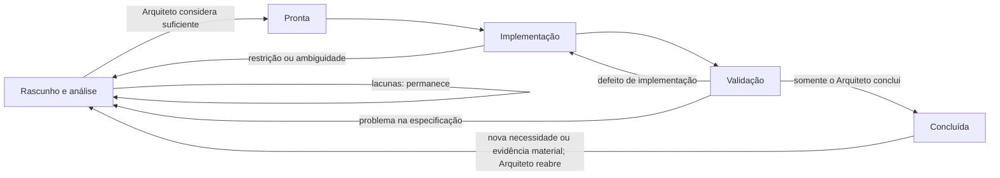

# EKOM Guidelines

**Modelo EKOM vigente:** 3.0

**Estado:** aprovado e vigente

Engineering Knowledge Orchestration Model (EKOM) é um modelo experimental de
orquestração de engenharia no qual a especificação governa a execução dos
agentes de IA, enquanto o Arquiteto mantém autoridade sobre decisões, riscos,
validação e conclusão do workflow.

Seu objetivo operacional é permitir que uma solução seja especificada,
implementada, documentada e entregue sem que o Arquiteto precise executar
diretamente o desenvolvimento. Agentes podem assumir amplamente a execução; o
Arquiteto preserva julgamento, prioridade, responsabilidade e autoridade.

> **Specifications orchestrate. Code implements.**

O EKOM sucede a formulação Engineering Knowledge Model (EKM) 1.x. O nome EKM,
os identificadores `EKM-CHG` e `EKM-GAP` e os registros de experimentos
anteriores são preservados como história e compatibilidade. A mudança de nome
está registrada no [`ADR-0001`](docs/adr/ADR-0001-EKM-TO-EKOM.md); a revisão
operacional 3.0 está no
[`ADR-0002`](docs/adr/ADR-0002-EKOM-3-OPERATIONAL-AUTHORITY.md).

O EKOM deve começar pequeno. Governança é útil quando acelera decisões, reduz
retrabalho ou aumenta confiança; não quando apenas multiplica documentos,
agentes ou passagens operacionais.

## Princípios da versão 3.0

- A especificação é a fonte da verdade, nasce antes do código e possui ciclo de
  vida próprio.
- Conhecimento, decisões e evidências permanecem persistentes, rastreáveis e
  evolutivos.
- Agentes de IA podem investigar, implementar, verificar, documentar e produzir
  evidências dentro do recorte autorizado.
- O Arquiteto é a autoridade final sobre arquitetura, risco aceitável,
  relevância das críticas, suficiência das evidências, aprovação e conclusão ou
  reabertura do workflow.
- Análise de implementabilidade é obrigatória; segregação em um Engenheiro
  Analista separado não é.
- Challenge e revisão são capacidades consultivas acionadas quando o risco ou o
  Arquiteto justificarem uma segunda perspectiva.
- Testes automatizados são evidências, não prova absoluta; sua exigência e a
  combinação de evidências são proporcionais ao risco e ao valor.
- A IA amplia a capacidade do Arquiteto; não o substitui.

Os princípios normativos completos estão em
[`docs/PRINCIPLES.md`](docs/PRINCIPLES.md).

## Workflow governado pela especificação



A especificação governa o fluxo e pode avançar ou retornar conforme o trabalho
produz conhecimento. Os agentes executam e registram evidências; retornos não
representam necessariamente fracasso, mas aprendizado controlado. O Arquiteto
decide as transições relevantes e é o único que determina conclusão ou
reabertura. A fonte Mermaid reutilizável está em
[`diagrams/ekom-specification-lifecycle.mmd`](diagrams/ekom-specification-lifecycle.mmd).

## Capacidades e responsabilidades

| Participante ou capacidade | Responsabilidade |
|---|---|
| Arquiteto | decidir arquitetura, prioridade, risco aceitável, relevância das críticas, suficiência das evidências, aprovação, conclusão e reabertura |
| Autor da Especificação | investigar repositório e arquitetura e transformar intenção em contrato implementável e verificável |
| Análise de implementabilidade | registrar evidências, impactos, restrições, incertezas, experimentos necessários e bloqueadores; pode ser exercida pelo Autor, por IA, por agente especializado ou por especialista separado |
| Implementador | implementar conforme a especificação, verificar tecnicamente, registrar decisões locais, dúvidas, limitações, desvios e evidências |
| Crítico ou Revisor | oferecer challenge consultivo, sem autoridade para aprovar, reprovar, redefinir aceite ou reabrir decisões sem nova evidência |

Uma segunda perspectiva é especialmente valiosa em segurança, autorização,
corrupção de dados, concorrência, operações irreversíveis, falhas recorrentes ou
mudanças de alto risco. Ela não é presumida independente apenas por vir de
outro agente com capacidades, contexto ou vieses semelhantes. O crítico pode
concluir honestamente que não encontrou risco adicional relevante.

O Consultor de Arquitetura é um papel institucional de apoio transversal,
subordinado ao Arquiteto, e não uma autoridade paralela.

## Validação baseada em evidências

Testes são especialmente valiosos para regressões, regras complexas, casos
limítrofes, segurança e contratos estáveis. Não devem ser alterados apenas para
produzir resultado verde, nem usados pelo Implementador como argumento
autorreferente de correção.

Conforme o contexto, a aceitação pode combinar código e diffs, builds, execução
em ambiente real, logs, testes, integração com hardware, APIs, bancos e
infraestrutura, relatórios dos atores, decisões do Arquiteto e defeitos
encontrados posteriormente. Em firmware e integrações, evidência no ambiente
real pode ter precedência funcional sobre testes isolados. O Arquiteto decide
se o conjunto é suficiente e qual risco residual aceita.

## Aprendizado experimental contínuo

As hipóteses da EKOM são continuamente confrontadas com experimentos reais.
Teorias, papéis e mecanismos podem ser confirmados, ajustados ou refutados
conforme evidências materiais produzidas pelos workflows. A EKOM não trata suas
premissas como dogmas: seu próprio modelo faz parte do objeto de aprendizado.

O histórico preserva tanto resultados positivos quanto falhas, custos,
limitações e defeitos posteriores. A evolução do modelo permanece rastreável em
ADRs, decisões de desenho, histórico experimental e Git, sem reinterpretar
retroativamente experimentos executados sob versões anteriores.

## Responsabilidades das fontes

```text
Especificação → fonte normativa do comportamento, limites, estados e aceite
ADR/RFC       → razão de decisões; referencia a especificação afetada
Diretriz      → regras do método e de preservação
Mapa          → localização das especificações, fontes derivadas e lacunas
Changelog     → evolução, decisões, lacunas, evidências e resultado
Código/testes → implementação e evidências técnicas
Git           → commits, autoria, diferenças e linhagem
Relatório     → evidência de uma execução; não cria requisitos
```

"Fonte da verdade" não significa "arquivo único". Para cada comportamento,
existe uma autoridade normativa identificável; fontes derivadas não competem
com ela.

## Estrutura inicial recomendada

```text
AGENTS.md
docs/
├── rfc/
│   ├── KNOWLEDGE-MAP.md
│   └── EKOM-CHANGELOG.md
└── specs/
    └── SYSTEM-DOSSIER.md
```

## Conteúdo

- [`docs/EKOM-CONCEPT.md`](docs/EKOM-CONCEPT.md): definição, objetivo e limites.
- [`docs/EKOM-METHOD.md`](docs/EKOM-METHOD.md): método de referência 3.0.
- [`docs/VISION.md`](docs/VISION.md): visão e horizonte evolutivo.
- [`docs/PRINCIPLES.md`](docs/PRINCIPLES.md): princípios normativos.
- [`docs/GOVERNANCE.md`](docs/GOVERNANCE.md): evolução e versionamento.
- [`docs/DESIGN-DECISIONS.md`](docs/DESIGN-DECISIONS.md): registro equivalente
  ao changelog de versões e decisões do modelo.
- [`docs/EXPERIMENT-HISTORY.md`](docs/EXPERIMENT-HISTORY.md): experimentos e aprendizados.
- [`docs/adr/`](docs/adr/): decisões arquiteturais do modelo.
- [`roles/`](roles/): perfis acionáveis por responsabilidade.
- [`templates/`](templates/): ativos reutilizáveis para adoção.

## Limite atual e horizonte

O EKOM 3.0 não promete substituição do Arquiteto nem autonomia completa de
julgamento. A interpretação conservadora da pesquisa pública e dos experimentos
registrados é que eles ainda não sustentam engenharia de software amplamente
autônoma, de ponta a ponta, sem supervisão e autoridade humanas. A base pública
dessa inferência está registrada no [`ADR-0002`](docs/adr/ADR-0002-EKOM-3-OPERATIONAL-AUTHORITY.md).
Autonomia completa permanece horizonte evolutivo, condicionado a novas
evidências, e não capacidade comprovada ou promessa atual.

O modelo não substitui testes, revisão, observabilidade, infraestrutura de
CI/CD ou julgamento humano. Ele os coordena de forma proporcional, preservando
a possibilidade de alterar o próprio método quando a evidência contrariar suas
hipóteses.
