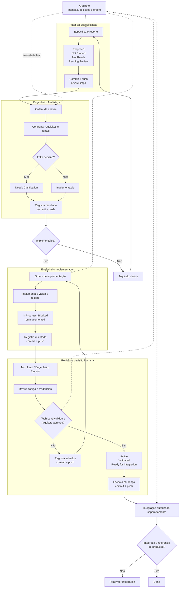

# Método EKM

**Versão do documento:** 1.15

**Modelo EKM:** 1.19

**Estado:** aprovado e vigente

## 1. Objetivo

A EKM organiza intenção, execução e evidência para acelerar a entrega de
software sem transferir decisões de produto ou arquitetura aos agentes. O
método deve começar com a menor dose de governança capaz de manter:

- conhecimento vigente;
- decisões relevantes registradas;
- execução auditável;
- resultados verificáveis.

Um controle que não melhora essas quatro propriedades ou a velocidade e a
qualidade da entrega não deve ser obrigatório.

## 2. Autoridade

O Arquiteto humano é a autoridade final sobre intenção, prioridade, escopo,
arquitetura, risco aceito, autorização, validação e integração.

Decisões e recomendações de agentes são subordinadas às decisões do Arquiteto.
O agente deve apontar conflitos e consequências observáveis, mas não pode
substituir uma decisão humana nem expandir silenciosamente o escopo recebido.

A autoridade humana não altera fatos. Uma validação que falhou continua
registrada como falha; o Arquiteto pode aceitar o risco ou decidir prosseguir,
mas não converter a evidência em aprovação técnica inexistente. Quando uma
decisão humana muda o comportamento esperado, a especificação deve ser
atualizada.

## 3. Fontes de conhecimento

| Fonte | Responsabilidade |
|---|---|
| Especificação | comportamento, limites e critérios de aceite |
| Diretriz | regras locais de trabalho e preservação |
| Mapa de conhecimento | localização das fontes e lacunas |
| Changelog EKM | decisões, lacunas, evidências e resultado das mudanças |
| Dossiê | visão geral e navegação do sistema |
| Código e testes | implementação e evidência executável |
| Relatório | evidência de uma execução; não cria requisito |

Git registra autoria técnica, commits, diferenças, branches e linhagem. Esses
dados não devem ser copiados manualmente para documentos EKM, salvo quando um
dado Git for necessário para explicar uma decisão ou um desvio material.

### 3.1 Preservação arquitetural local

Cada repositório localiza no `AGENTS.md` suas fontes de arquitetura, padrões e
restrições. Por padrão, toda implementação:

- preserva a arquitetura, a organização e a separação de responsabilidades
  vigentes;
- coloca novos arquivos junto ao componente equivalente mais próximo;
- segue os padrões de nomenclatura, dependência e estrutura do precedente
  canônico aplicável;
- não cria nova camada, pasta estrutural, abstração transversal ou padrão
  arquitetural por preferência do agente.

Uma especificação Implementável [`Implementable`] pode determinar uma evolução
arquitetural. A exceção só é explícita e consciente quando identifica:

1. o padrão, a restrição ou o precedente atual afetado;
2. a mudança pretendida;
3. o alcance da mudança;
4. a justificativa ou decisão do Arquiteto que a sustenta.

Ausência de orientação, necessidade técnica inferida, oportunidade de melhoria
ou texto genérico não autorizam desvio. Quando não houver precedente claro ou
existirem precedentes conflitantes, o conflito deve ser registrado e devolvido
ao Arquiteto, em vez de resolvido pela criação incidental de uma nova
arquitetura.

Preservar o padrão vigente não transforma todo código legado em modelo
normativo nem impede evolução. Significa apenas que mudanças arquiteturais são
deliberadas, delimitadas e verificáveis.

## 4. Unidade de trabalho

Uma especificação incremental é a unidade de comportamento e delegação. Ela
deve conter apenas o necessário para executar e verificar o recorte:

- objetivo e contexto;
- escopo e fora de escopo;
- requisitos verificáveis;
- contratos, estados e falhas relevantes;
- critérios de aceite e validações;
- relações normativas e lacunas conhecidas;
- resultado da revisão de implementabilidade.

Versões concluídas da especificação são preservadas. Mudanças posteriores usam
uma nova versão relacionada por `Amends`, `Supersedes`, `Corrects` ou `Retires`.

### 4.1 Critérios de aceite assertáveis

Cada requisito obrigatório deve possuir critério de aceite suficiente para que
o executor determine, sem inventar o comportamento esperado, se a evidência
aprova, reprova ou não permite verificar o requisito.

Um critério assertável identifica, na menor forma adequada ao risco:

1. o cenário ou condição inicial relevante;
2. a ação, entrada ou evento observado;
3. o resultado observável esperado;
4. a evidência capaz de distinguir sucesso, falha e ausência de execução.

Pode referenciar teste, inspeção, análise estática, observabilidade ou validação
humana. Não precisa repetir o requisito nem impor formato universal. Agrupar
requisitos é permitido somente quando a mesma evidência e o mesmo oráculo
comprovarem todos eles sem ocultar comportamento específico.

Critérios como “adicionar testes”, “validar o fluxo” ou “build aprovado” são
insuficientes quando não definem o que deve ser afirmado. Mocks, fakes,
emuladores e fixtures devem preservar as semânticas materiais do componente
substituído; caso contrário, a evidência deve usar a integração real.

Compilação comprova compilabilidade, não execução. Quando o critério exigir
comportamento executado, a evidência registra casos executados e resultado
terminal; zero casos, execução não iniciada, erro de infraestrutura ou estado
desconhecido não aprovam o critério.

#### Procedimento do Autor

O Autor mantém uma relação rastreável entre requisitos obrigatórios e critérios
de aceite. Para cada requisito, identifica os cenários nominais, falhas e
condições de borda expressamente requeridos e descreve condição inicial, ação,
resultado observável e evidência terminal.

Antes de encaminhar a especificação ao Analista, o Autor confirma que:

- nenhum requisito obrigatório depende apenas de objetivo ou narrativa;
- um executor independente pode converter o resultado em asserção sem escolher
  o comportamento esperado;
- a evidência consegue reprovar uma implementação plausível, não apenas
  confirmar presença de código, teste ou build;
- doubles preservam as semânticas materiais relevantes da integração
  substituída;
- validações automatizáveis estão separadas das validações humanas, físicas ou
  de integração posteriores;
- ambiguidades funcionais ou arquiteturais restantes estão registradas como
  decisões ausentes.

O procedimento não exige um teste por requisito, formato universal ou desenho
interno antecipado. Um critério pode cobrir mais de um requisito somente quando
o mesmo cenário, resultado e evidência os comprovarem integralmente.

### 4.2 Objetivos que atravessam múltiplos contextos de entrega

Um objetivo pode depender de mudanças em repositórios, serviços, aplicativos ou
infraestruturas com fontes normativas e ciclos de integração independentes.
Nessa situação, uma especificação local não deve absorver contratos alheios nem
autorizar implicitamente alterações fora do próprio contexto.

A coordenação usa a menor estrutura suficiente:

- uma especificação coordenadora preserva o objetivo ponta a ponta, as decisões
  de arquitetura, as relações entre os recortes e os critérios de integração;
- cada contexto de entrega possui uma especificação subordinada executável,
  mantida junto às próprias fontes e implementação;
- as relações identificam a especificação, a fonte responsável, a dependência e
  o estado material necessário, sem copiar commits ou o conteúdo integral da
  outra fonte;
- cada especificação percorre o fluxo normal de atores e promove somente seus
  próprios estados;
- o resultado coordenado só pode ser declarado quando as evidências dos
  recortes obrigatórios e a validação de integração sustentarem o objetivo
  ponta a ponta.

Uma dependência externa sem contrato suficiente pode produzir Precisa de
esclarecimento [`Needs Clarification`]. Quando o contrato necessário já está
definido, mas sua entrega ainda está pendente, o Analista registra uma
dependência de entrega; isso não deve ser convertido artificialmente em decisão
arquitetural ausente.

A coordenação não cria um ator central, uma branch comum entre repositórios nem
um estado global que substitua os estados locais. O Arquiteto continua
ordenando cada atuação e decidindo a integração. Concorrência, locks, filas e
orquestração permanecem fora do método.

## 5. Estados

Os estados permanecem independentes:

### 5.1 Estado normativo

- Rascunho [`Draft`]
- Proposta [`Proposed`]
- Aprovada [`Approved`]
- Vigente [`Active`]
- Substituída [`Superseded`]
- Retirada [`Withdrawn`]
- Arquivada [`Archived`]

### 5.2 Estado da implementação

- Não iniciada [`Not Started`]
- Em andamento [`In Progress`]
- Implementada [`Implemented`]
- Validada [`Validated`]
- Regredida [`Regressed`]
- Bloqueada [`Blocked`]
- Descontinuada [`Retired`]

### 5.3 Estado da entrega

- Não pronta [`Not Ready`]
- Pronta para integração [`Ready for Integration`]
- Concluída [`Done`]

### 5.4 Revisão de implementabilidade

- Pendente de revisão [`Pending Review`]
- Implementável [`Implementable`]
- Precisa de esclarecimento [`Needs Clarification`]

O estado declarado na especificação, combinado com a ordem do Arquiteto,
determina se a próxima etapa pode começar. Não é obrigatório registrar
manualmente SHA, branch de origem, checkpoint ou cadeia de commits para
autorizar a transição.

## 6. Ordem do Arquiteto

Cada tarefa do ciclo de uma especificação é iniciada por uma ação do Arquiteto,
diretamente por prompt ou por comando de pipeline. Essa ação:

- identifica o papel, o resultado, o recorte autorizado e a especificação
  quando a atuação pertencer ao ciclo funcional;
- autoriza apenas as operações normais necessárias àquela etapa;
- não concede liberdade para ampliar requisitos ou tomar decisões reservadas
  ao Arquiteto.

Antes de agir, o agente lê:

1. o `AGENTS.md` do projeto;
2. as regras comuns dos perfis;
3. exatamente um perfil correspondente ao papel recebido;
4. a especificação indicada, quando aplicável;
5. somente as fontes técnicas pertinentes ao recorte.

Não carrega perfis de outros papéis nem a metodologia completa, salvo ordem
explícita de governança. Se a ordem não identificar papel, resultado e recorte,
a tarefa não começa. A especificação é obrigatória para o ciclo funcional; o
Consultor pode receber Não se aplica [`Not Applicable`] em governança,
arquitetura ou apoio fora desse ciclo.

Tarefas de adoção inicial ou governança do próprio método ficam fora do ciclo
funcional e exigem ordem explícita com seu recorte documental.

Não é necessário criar um registro adicional de aprovação com nome, data, SHA
ou assinatura para repetir a ordem recebida pelos atores do fluxo funcional.
O Consultor de Arquitetura é a exceção proporcional definida na seção 7.5:
devido ao seu recorte transversal, registra ao final a autorização e as
decisões explicitamente confirmadas pelo Arquiteto, sem copiar metadados Git.

Uma ordem de análise autoriza somente análise e atualização dos artefatos de
conhecimento correspondentes. Uma ordem de implementação autoriza a
implementação somente quando a especificação estiver Implementável
[`Implementable`].

## 7. Fluxo oficial por atores

Os atores oficiais são:

| Ator | Perfil oficial |
|---|---|
| Autor da Especificação | `roles/AUTOR-DA-ESPECIFICACAO.md` |
| Engenheiro Analista | `roles/ENGENHEIRO-ANALISTA.md` |
| Engenheiro Implementador | `roles/ENGENHEIRO-IMPLEMENTADOR.md` |
| Engenheiro Revisor, que pode corresponder ao Tech Lead humano | `roles/ENGENHEIRO-REVISOR.md` |

O fluxo é uma ordem lógica de atuações sequenciais, não uma infraestrutura de
orquestração:



Cada ator encerra a própria etapa: atualiza a especificação e o conhecimento
materialmente afetado, promove somente os estados sustentados por sua atuação,
cria commit, realiza push e termina com árvore limpa. Não existe um ator
adicional destinado apenas a reconciliar ou versionar o resultado dos demais.

### 7.1 Autor da Especificação

O Autor analisa o problema na profundidade necessária para transformar a
intenção recebida em uma solução proposta, implementável e verificável. Pode
inspecionar fontes técnicas, confrontar restrições, comparar alternativas e
propor arquitetura, fluxos, contratos e critérios de aceite.

Para cada requisito obrigatório, o Autor define critério assertável ou registra
a decisão ausente que impede fazê-lo. O critério não antecipa estrutura interna
desnecessária, mas torna explícito o resultado observável e a evidência capaz de
reprová-lo.

A autoria deve distinguir:

- fatos observados nas fontes;
- intenção e decisões confirmadas pelo Arquiteto;
- solução e recomendações propostas pelo Autor;
- decisões pendentes que exigem autoridade humana.

Uma recomendação do Autor não se torna decisão confirmada por estar na
especificação. O Autor não deve criar lacuna bloqueante para alternativa
opcional, comportamento fora do escopo ou escolha técnica que não dependa de
intenção, produto, arquitetura ou risco ainda não decidido.

A análise necessária à autoria não é revisão de implementabilidade. O Autor
não promove a própria proposta para Implementável [`Implementable`] nem ocupa
a responsabilidade do Engenheiro Analista. Ao terminar, deixa a especificação
como Proposta [`Proposed`], Não iniciada [`Not Started`], Não pronta
[`Not Ready`] e Pendente de revisão [`Pending Review`]. O próprio Autor
registra e entrega essa promoção.

### 7.2 Engenheiro Analista

O Analista verifica se os requisitos podem ser implementados sem decisão
normativa, de produto ou arquitetura não declarada. A análise deve cobrir o
recorte necessário para sustentar o resultado, sem exigir uma matriz universal.

Declarar `Implementable` exige também confirmar que os critérios obrigatórios
possuem oráculos assertáveis e meios de evidência viáveis. Critério que apenas
nomeia uma validação, depende de mock semanticamente incompatível ou não
distingue execução de compilação constitui decisão ou contrato ainda
insuficiente.

Se encontrar uma lacuna bloqueante, pode encerrar a análise assim que a decisão
necessária estiver clara. Deve registrar os demais bloqueios materiais já
observados, mas não é obrigado a continuar uma inspeção sem valor para obter uma
lista exaustiva.

O resultado é:

- Implementável [`Implementable`], quando o recorte pode ser executado sem
  inferência relevante; ou
- Precisa de esclarecimento [`Needs Clarification`], quando falta uma decisão
  necessária.

O Analista não altera a implementação. Ele registra a revisão de
implementabilidade, as decisões ausentes, as evidências e as lacunas
relacionadas e entrega sua própria promoção.

### 7.3 Engenheiro Implementador

O Implementador segue a especificação Implementável [`Implementable`], atualiza
código, testes e conhecimento afetado e executa validações proporcionais ao
risco. Decisões ausentes interrompem a implementação e retornam ao Arquiteto;
não são preenchidas por conveniência técnica.

Resultado de build, teste, inspeção, hardware ou outra validação deve ser
registrado quando for material para comprovar ou limitar a entrega. Não se
registram comandos de leitura, arquivos temporários ou detalhes operacionais
sem efeito sobre a conclusão.

O estado permanece Em andamento [`In Progress`] enquanto faltar implementação
ou validação obrigatória da etapa. Implementada [`Implemented`] exige código e
validações automatizáveis obrigatórias. A promoção posterior para Validada
[`Validated`] pertence ao Engenheiro Revisor com as evidências humanas
requeridas.

O Implementador avalia cada critério obrigatório contra evidência terminal.
Critério falho, não executado ou não verificável mantém a implementação Em
andamento [`In Progress`], ainda que código e testes compilem.

O Implementador registra na própria especificação o estado sustentado e entrega
essa promoção com o restante da implementação.

### 7.4 Engenheiro Revisor, decisão e integração

O Revisor encerra o ciclo técnico quando existem revisão, validação e decisão
humana a registrar. A profundidade da revisão é proporcional ao risco.
Revisões independentes adicionais, inclusive auditoria de integridade EKM, são
executadas somente quando o Arquiteto as solicitar.

O Revisor confronta comportamento, arquitetura, compatibilidade, testes,
evidências e conhecimento sem corrigir a implementação na mesma atuação. Sem
aprovação explícita do Arquiteto, registra achados e preserva estados
compatíveis com as evidências.

O confronto verifica se a evidência usa o oráculo definido, preserva as
semânticas materiais de integrações substituídas e distingue compilação,
execução, falha e limitação de ambiente.

Quando a ordem contém validação suficiente do Tech Lead e aprovação explícita
do Arquiteto, o Revisor registra essa evidência recebida e promove:

- estado normativo para Vigente [`Active`];
- implementação para Validada [`Validated`];
- entrega para Pronta para integração [`Ready for Integration`];
- transação para Fechada [`Closed`], quando suas condições estiverem
  satisfeitas.

O Revisor não produz aprovação própria. Quando o Arquiteto confirma que o
resultado aceito foi integrado à referência de produção, o Revisor registra a
evidência e promove a entrega para Concluída [`Done`]. Um pull request aberto,
isoladamente, não comprova integração.

### 7.5 Consultor de Arquitetura — papel institucional fora do fluxo

O Consultor de Arquitetura é um agente de IA que apoia o Arquiteto e o Tech
Lead em investigação, desenho, governança EKM, especificação, análise,
implementação, revisão e coordenação. Ele pode executar atividades materiais
dessas naturezas somente quando a ordem do Arquiteto identificar:

- objetivo e resultado esperado;
- repositório ou contexto de entrega;
- recorte e fontes aplicáveis;
- operações autorizadas;
- decisões já confirmadas e limites ainda pendentes.

O Arquiteto permanece o ator principal e a autoridade sobre intenção,
arquitetura, risco, autorização, validação e integração. O Tech Lead pode
colaborar com o Consultor, mas não amplia seu recorte nem confirma decisões
reservadas ao Arquiteto sem delegação humana explícita.

O papel não concede autorização genérica. Uma nova operação material,
ampliação de escopo, decisão arquitetural, implementação, ação destrutiva,
integração ou publicação exige autorização correspondente antes da execução.
Recomendações do Consultor não são decisões confirmadas.

O Consultor não substitui os quatro atores oficiais nem promove estados que
pertencem a uma etapa formal sem nova ordem que selecione o papel aplicável.
Quando participa da solução, especificação ou implementação de um recorte, não
pode alegar análise, revisão ou Gate independente desse mesmo recorte. Uma
atuação posterior pode contribuir tecnicamente, mas deve registrar o conflito
de independência.

Antes do commit final, o Consultor apresenta ao Arquiteto um registro conciso
com a ordem, o recorte, as operações, as decisões confirmadas, o resultado e
as limitações. O commit só ocorre após confirmação explícita desse registro
pelo Arquiteto. Essa confirmação possui apenas o significado declarado: não
comprova aprovação técnica, validação ou integração sem texto humano
específico.

O registro fica na fonte materialmente apropriada — decisão de desenho,
especificação, changelog ou relatório de governança — e não copia prompt,
conversa, SHA, branch ou mensagem de commit. A entrega continua exigindo
commit, push e árvore limpa.

## 8. Contrato Git de cada tarefa

Toda tarefa de agente deve:

1. começar em uma branch de trabalho derivada da `main`, nunca diretamente na
   `main`;
2. começar com a árvore de trabalho limpa;
3. produzir um resultado material e versionável;
4. criar um commit ao fim da etapa;
5. enviar o commit ao repositório remoto por push;
6. terminar com a árvore de trabalho limpa.

A branch pode atravessar as etapas autorizadas do mesmo recorte. A exigência é
que o fluxo de trabalho tenha sido iniciado a partir da `main`; não é necessário
criar uma nova branch para cada atuação, atualizar a branch com avanços
posteriores da `main` nem copiar a branch de origem para os documentos EKM.

Uma tarefa não usa commit vazio para simular entrega. Mesmo quando não houver
mudança de código, a conclusão material da etapa deve atualizar o artefato EKM
apropriado, como a especificação, a transação ou o registro de evidência.

Falha no push significa que a etapa ainda não foi entregue para a próxima
etapa. A ordem da tarefa autoriza commit e push normais na branch indicada, mas
não autoriza force push, reescrita de histórico, merge, tag, release ou deploy
sem ordem correspondente do Arquiteto.

O próprio Git é a evidência desses atos. Não é obrigatório repetir hashes,
branch ou mensagem do commit no `EKM-CHANGELOG.md`.

### 8.1 Gate de encerramento de execuções iniciadas

Uma etapa não está pronta para conclusão enquanto tarefa, comando, processo,
build, teste, upload ou execução delegada iniciada pelo agente permanecer em
estado não terminal ou desconhecido.

Antes de promover estados, declarar evidência aprovada, criar o commit final,
realizar push ou responder conclusivamente, o agente identifica as execuções
que iniciou, confirma seus estados terminais e captura resultados, códigos de
saída e limitações materiais. `Running`, `queued`, `pending`, `waiting`, estado
desconhecido ou equivalente bloqueia essas ações.

O agente pode realizar outro trabalho autorizado enquanto aguarda. Se não for
possível observar ou concluir uma execução, registra a limitação sem fabricar
sucesso. Cancelar trabalho dentro do recorte não converte resultado incompleto
em evidência aprovada.

## 9. Transações e lacunas

`EKM-CHG-NNNN` identifica uma mudança de conhecimento ou implementação.
`EKM-GAP-NNNN` identifica conhecimento ausente que precise sobreviver à tarefa.

Uma transação deve registrar somente:

- objetivo e especificação relacionada;
- decisões que alteram entendimento ou execução;
- lacunas relevantes;
- evidências materiais;
- estado e resultado.

Ela não deve funcionar como diário de comandos, espelho do histórico Git ou
formulário de passagem entre agentes.

Estados recomendados da transação:

- Aberta [`Open`]
- Bloqueada [`Blocked`]
- Substituída [`Superseded`]
- Fechada [`Closed`]

O fechamento ocorre quando o recorte autorizado foi entregue por commit e push,
as fontes afetadas estão atuais, as evidências materiais estão registradas e as
lacunas restantes estão explícitas. Fechar a transação não significa que a
especificação está Concluída [`Done`]; o estado da entrega informa separadamente
se houve integração. Não se exige um commit posterior apenas para copiar
metadados do Git.

## 10. Adoção em legado

A adoção começa pequena:

1. inventariar o sistema e localizar fontes existentes;
2. criar a fundação mínima;
3. registrar lacunas que afetam decisões reais;
4. especificar em profundidade somente o que for tocado;
5. aumentar controles apenas quando a experiência demonstrar valor.

Fundação recomendada:

```text
AGENTS.md
docs/
├── rfc/
│   ├── KNOWLEDGE-MAP.md
│   └── EKM-CHANGELOG.md
└── specs/
    └── SYSTEM-DOSSIER.md
```

`EKM-GUIDELINES.md` local é necessário apenas quando o projeto não referencia
uma diretriz externa aplicável ou precisa declarar regras próprias.

## 11. Avaliação experimental dos atores

A adequação é atribuída ao perfil executor — modelo, ambiente, configuração,
instruções e versão EKM — para um papel específico. Ela não é inferida apenas
do nome do modelo nem de uma única execução bem-sucedida.

A métrica experimental combina pontuação de autoridade e escopo, correção
técnica, evidências, conhecimento EKM e encerramento Git com desvios
eliminatórios que não podem ser compensados pela soma. Aceitação exige amostra
de múltiplas execuções e contextos.

O protocolo, os limiares e o registro mínimo estão em
[`ACTOR-EVALUATION.md`](ACTOR-EVALUATION.md). Durante a fase experimental, a
avaliação não é uma etapa obrigatória de toda tarefa nem substitui decisão do
Arquiteto.

## 12. Limites atuais

A EKM 1.19 não define orquestração, concorrência, locks ou filas entre atores. O
gate de encerramento controla somente execuções iniciadas pelo próprio agente e
não constitui um mecanismo de coordenação. Esses mecanismos não fazem parte do
fluxo nem dos critérios dos experimentos atuais.

A coordenação multi-contexto organiza conhecimento, dependências e evidência;
ela não executa publicação distribuída, não sincroniza automaticamente estados
entre repositórios e não presume consistência apenas porque os recortes locais
foram concluídos.

O modelo também não afirma que documentação substitui código, testes,
observabilidade ou julgamento humano. Sua utilidade deve ser medida pela
capacidade de entregar e descartar hipóteses mais rapidamente, preservando
conhecimento suficiente para compreender e verificar o resultado.
