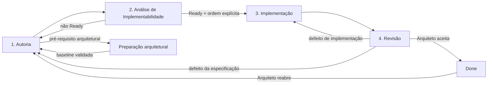

# Método EKOM

**Versão do documento:** 4.0

**Modelo EKOM:** 4.0

**Estado:** aprovado e vigente

## 1. Objetivo operacional

O EKOM permite que uma solução seja especificada, implementada, documentada e
entregue sem que o Arquiteto precise executar diretamente o desenvolvimento.
A especificação governa a execução dos agentes de IA; o Arquiteto mantém
autoridade sobre decisões, riscos, validação e conclusão do workflow.

> **Specifications orchestrate. Code implements.**

O método usa a menor dose de governança capaz de manter conhecimento vigente,
decisões relevantes registradas, execução auditável e resultados verificáveis.
Um controle sem ganho proporcional não é universalizado.

## 2. Autoridade do Arquiteto

O Arquiteto humano é a autoridade final sobre:

- intenção, prioridade e escopo;
- decisões arquiteturais;
- risco aceitável;
- relevância das críticas;
- suficiência das evidências;
- aprovação da solução;
- conclusão ou reabertura do workflow;
- integração, publicação e operação quando aplicável.

O Arquiteto não é um aprovador formal de decisões da IA. Ele confronta
recomendações e fatos, decide e assume responsabilidade pelo risco. Agentes
podem apontar conflitos, consequências e alternativas, mas não substituem essa
decisão nem expandem silenciosamente o escopo.

Autoridade humana não modifica evidência. Uma validação falha continua
registrada como falha. O Arquiteto pode aceitar risco residual, pedir nova
evidência, corrigir a implementação ou evoluir a especificação.

## 3. Especificação e fontes relacionadas

| Fonte | Responsabilidade |
|---|---|
| Especificação | comportamento, limites, estados e critérios de aceite |
| ADR ou RFC | razão de decisão e relação com a especificação afetada |
| Diretriz | regras do método e preservação local |
| Mapa de conhecimento | localização de fontes e lacunas |
| Changelog EKOM | estado resumido da transação e ponteiros para fontes materiais |
| Dossiê | visão factual e navegação do sistema |
| Código e testes | implementação e evidências técnicas |
| Relatório | evidência de uma execução; não cria requisito |

Para cada comportamento existe uma autoridade normativa identificável.
"Fonte da verdade" não exige arquivo monolítico: especificações podem se
relacionar sem duplicar contratos.

Git registra autoria, branches, diferenças e linhagem. Esses dados não são
copiados manualmente para documentos, salvo quando necessários para explicar
decisão ou desvio material.

### 3.1 Preservação arquitetural local

O `AGENTS.md` do projeto localiza arquitetura, padrões e restrições. Por padrão,
toda implementação preserva organização e separação de responsabilidades,
segue o precedente equivalente mais próximo e não cria nova camada, estrutura
ou abstração transversal por preferência do agente.

Uma evolução arquitetural identifica o padrão atual, a mudança, o alcance e a
decisão do Arquiteto. Ausência ou conflito de precedentes é incerteza a
registrar, não autorização implícita.

### 3.2 Unidade de trabalho

A especificação incremental é a unidade de comportamento, delegação e
orquestração. Ela contém o necessário para executar e avaliar o recorte:

- objetivo, contexto, escopo e fora de escopo;
- requisitos, contratos, estados e falhas relevantes;
- critérios de aceite e evidências esperadas;
- impactos, restrições, incertezas e experimentos necessários;
- referência ao relatório de análise e estado vigente dos bloqueadores.

Versões concluídas são preservadas. Mudanças posteriores usam nova versão
relacionada por `Amends`, `Supersedes`, `Corrects` ou `Retires`, ou reabertura
explícita pelo Arquiteto quando a convenção local assim determinar.

### 3.2.1 Confronto de autoridade durante a autoria

Antes de recomendar prontidão, o Autor confronta a proposta com as fontes que
já governam cada elemento afetado. O recorte considera comportamento, API,
estado, ciclo de vida, persistência, compatibilidade, nomenclatura e fronteiras,
e não apenas dependências diretas de código.

O confronto mínimo:

1. localiza autoridades pelo mapa, dossiê, especificações e ADRs pertinentes;
2. classifica a relação como preservação, `New`, `Amends`, `Supersedes`,
   `Corrects` ou `Retires`;
3. identifica conflito, exceção, decisão transversal e fonte que precisa
   mudar;
4. registra a relação vigente na especificação e a matriz detalhada no
   relatório de análise;
5. devolve ao Arquiteto qualquer relação ambígua ou conflito normativo antes da
   prontidão.

Esse confronto é orientado por impacto, não uma leitura universal do acervo.
Uma especificação exploratória pode nascer com lacunas, mas não pode ser
recomendada como pronta enquanto outra autoridade aplicável estiver omitida ou
contraditória. Ler uma fonte apenas como contexto técnico não equivale a
confrontar seu contrato.

### 3.2.2 Contenção de escopo e preparação arquitetural

Uma especificação funcional governa seu comportamento e as mudanças locais
necessárias; ela não absorve por acúmulo uma nova baseline arquitetural.
Implementabilidade é avaliada contra a arquitetura e o recorte vigentes.

Existe pré-requisito arquitetural quando uma capacidade necessária não existe,
pode receber objetivo e validação independentes da funcionalidade e altera
materialmente lifecycle, ownership, concorrência, persistência, recuperação,
protocolo, segurança, API reutilizável, autoridades ou consumidores fora do
recorte. Impacto material ainda não delimitado também impede prontidão.

O Autor mantém a funcionalidade em `Draft` e registra a dependência. O relatório
de análise delimita a capacidade ausente e recomenda análise arquitetural. O
Arquiteto decide se muda o desenho, aceita alteração local, cria ADR ou autoriza
especificação preparatória. A funcionalidade usa `Depends On`; a preparação,
`Enables`, sem duplicação de contrato.

A implementação funcional só é retomada depois que a preparação tiver sido
implementada e validada e a especificação for reconfrontada com a nova
baseline. A regra completa está na
[`ADR-0006`](adr/ADR-0006-SPECIFICATION-SCOPE-AND-ARCHITECTURAL-PREREQUISITES.md).

### 3.3 Critérios assertáveis sem fetichizar testes

Cada requisito obrigatório deve permitir distinguir sucesso, falha e ausência
de evidência. Na forma mínima adequada ao risco, o critério identifica cenário,
ação, resultado observável e meio de validação. `Dado / Quando / Então` é uma
linguagem útil, não obrigação de Gherkin ou ferramenta BDD.

Critérios como "adicionar testes", "validar o fluxo" ou "build aprovado" são
insuficientes quando não declaram o comportamento observado. Doubles preservam
a semântica material da integração substituída. Compilação comprova
compilabilidade, não execução; zero casos não comprova comportamento.

Isso não transforma teste em prova absoluta nem exige um teste por requisito.
O oráculo orienta a investigação e a evidência; o Arquiteto decide se o
conjunto produzido é suficiente para aceitar o risco.

### 3.4 Objetivos multi-contexto

Quando um objetivo atravessa repositórios, serviços, aplicativos ou
infraestrutura, uma especificação coordenadora preserva o objetivo ponta a
ponta e cada contexto mantém seu contrato local. A conclusão coordenada exige
evidências materiais dos recortes e da integração; estados locais não a
comprovam automaticamente.

### 3.5 Roteamento documental

Responsabilidade conceitual exige destino operacional. Projetos EKOM 3.1
declaram no `AGENTS.md` e no mapa caminhos distintos para especificações,
ADRs/RFCs, relatórios, changelog e mapa.

```text
Especificação → contrato vigente e evidências exigidas
ADR/RFC       → decisão arquitetural durável e suas consequências
Relatório     → fatos, achados e evidências de uma atuação
Mapa          → localização, autoridade, relações e lacunas
Changelog     → estado resumido da transação e referências
Git           → autoria, diferenças e linhagem técnica
```

Análise, implementação, challenge e validação produzem relatórios separados.
Esses relatórios podem recomendar mudança normativa, mas somente o Arquiteto a
incorpora à especificação ou aceita uma ADR. Relatórios concluídos são
históricos; correção factual usa adendo ou novo relatório relacionado.

ADR é obrigatória quando a decisão cruza especificações ou componentes,
estabelece fronteira ou direção de dependência, impõe restrição durável,
envolve trade-offs relevantes ou substitui decisão arquitetural anterior.
Comportamento local permanece na especificação; escolha local de execução,
no relatório.

O roteamento, os ciclos de vida e a migração estão definidos na
[`ADR-0003`](adr/ADR-0003-DOCUMENT-ROUTING-AND-EVIDENCE-SEPARATION.md).

### 3.6 Visões do mapa de conhecimento

O mapa combina três perguntas sem duplicar contratos:

| Visão | Pergunta |
|---|---|
| Índice tabular | Onde está a fonte e qual sua autoridade? |
| Árvore | Como alvos, domínios e responsabilidades se organizam? |
| Diagrama | Como elementos separados se conectam ou dependem entre si? |

O índice de autoridade é obrigatório. A árvore é obrigatória quando contenção,
composição ou responsabilidade for material, especialmente com múltiplos
runtime targets ou três ou mais domínios relacionados. Mermaid é obrigatório
quando alvos implantáveis separadamente se conectarem por protocolo, API,
eventos ou dados, ou quando um fluxo cruzar três ou mais fronteiras.

Uma visão não aplicável permanece declarada com justificativa curta. Visuais
devem ser pequenos, estáveis e navegacionais; comportamento detalhado continua
na especificação ou ADR apontada pelo mapa. A regra completa está na
[`ADR-0004`](adr/ADR-0004-KNOWLEDGE-MAP-VISUAL-STRUCTURE.md).

## 4. Ciclo de vida e workflow

O workflow possui quatro estágios de engenharia:



- **Autoria:** transforma intenção em contrato, confronta autoridades e deixa a
  versão em `Draft` para análise.
- **Análise de Implementabilidade:** confronta a versão com baseline, código,
  consumidores e restrições. `Ready` torna a versão elegível à ordem de
  implementação.
- **Implementação:** depois de `Ready` e ordem explícita, agentes registram
  `In Progress`, executam e verificam tecnicamente. Ambiguidade normativa
  retorna à Autoria.
- **Revisão:** confronta implementação, contrato e evidências. Defeito técnico
  retorna à Implementação; defeito normativo retorna à Autoria.

Somente o Arquiteto determina `Done`, integração ou reabertura. Esses são atos
de decisão, não estágios extras de engenharia.

Retornos não são necessariamente fracasso. São aprendizado e evolução
controlada da especificação. Projetos que precisem de estados técnicos mais
granulares podem mantê-los, desde que não transfiram a autoridade de conclusão.

### 4.1 Entrada da implementação

A passagem exige análise `Ready` aplicável à versão normativa corrente e ordem
explícita do Arquiteto para implementar essa versão. A ordem é a aprovação e a
autorização; não existe promoção intermediária nem campo documental obrigatório
de autorização.

O Implementador registra `In Progress` como primeiro efeito da atuação. Se
faltar `Ready`, se a fonte normativa mudou depois da análise ou se a ordem for
ambígua, recusa sem mutação e orienta análise ou ordem inequívoca.

Correção devolvida pela Revisão não exige nova autorização enquanto versão,
recorte, arquitetura e risco não mudarem. Diagnóstico e experimento sobre
`Draft` exigem ordem própria e não produzem implementação normativa. A regra
completa está na [`ADR-0009`](adr/ADR-0009-FOUR-STAGE-WORKFLOW.md).

## 5. Funções e papéis

Função necessária não implica pessoa, sessão ou agente separado. A segregação
é uma decisão proporcional a risco, incerteza, especialização e valor da
independência real.

### 5.1 Autor da Especificação

O Autor transforma a intenção em solução proposta, implementável e verificável.
Consulta repositório, arquitetura, conhecimento e precedentes. Pode usar IA
para localizar impactos, restrições e incertezas.

Ele diferencia fatos observados, decisões confirmadas, recomendações e
pendências. Não transforma comportamento legado em requisito nem preferência
técnica em decisão.

Antes de recomendar prontidão, identifica os elementos normativos afetados,
localiza suas autoridades e declara se a proposta preserva, altera, substitui,
corrige ou descontinua cada contrato pertinente. O detalhamento do confronto
permanece no relatório de análise; a especificação conserva somente as relações
e decisões normativas vigentes.

### 5.2 Análise de implementabilidade

A análise é obrigatória antes da implementação. Pode ser executada:

- pelo próprio Autor;
- pelo Autor apoiado por IA;
- por agente especializado;
- por especialista separado quando risco ou incerteza justificarem segregação.

Seu relatório registra:

- evidências encontradas no repositório;
- componentes e fontes impactados;
- restrições conhecidas;
- incertezas;
- experimentos necessários;
- bloqueadores identificados.

O resultado usa exatamente uma classificação principal:

- Pronta [`Ready`];
- Não pronta — defeito da especificação [`Not Ready — Specification Defect`];
- Não pronta — pré-requisito arquitetural [`Not Ready — Architectural
  Prerequisite`];
- Não pronta — evidência requerida [`Not Ready — Evidence Required`];
- Não implementável — conflito de restrição [`Not Implementable — Constraint
  Conflict`];
- Desconhecida — impacto não delimitado [`Unknown — Impact Not Delimited`].

`Prontidão condicionada` não é resultado final. Condições são classificadas
como bloqueantes ou não bloqueantes. A análise distingue correção pertencente à
funcionalidade de capacidade arquitetural independente e recomenda análise
abrangente quando retornos sucessivos continuarem revelando novos bloqueadores
transversais.

Leitura de código não certifica comportamento que só pode ser confirmado por
build, protótipo, API, banco, infraestrutura ou hardware. Esses pontos são
registrados como experimentos necessários. O resultado `Ready` torna a versão
elegível à ordem explícita de implementação.

### 5.3 Implementador

O Implementador:

- verifica análise `Ready` da versão corrente e ordem explícita antes de
  investigar a solução;
- recusa sem mutação quando faltar análise aplicável ou ordem inequívoca;
- registra `In Progress` como primeiro efeito da atuação;
- implementa conforme a especificação autorizada;
- executa o build canônico proporcional dos entregáveis construíveis afetados,
  sem exigir autorização repetida na especificação;
- realiza verificações técnicas proporcionais ao risco;
- registra decisões locais no relatório de implementação;
- produz relatório e evidências sem anexá-los à especificação;
- declara dúvidas, limitações e desvios;
- devolve ambiguidade normativa ao rascunho/análise.

Ele não usa testes escolhidos ou escritos durante a própria implementação como
argumento autorreferente de correção. Testes compõem a evidência disponível e
podem ser fortes, insuficientes ou até semanticamente enganosos.

### 5.3.1 Build como obrigação da implementação

A autorização de implementação inclui o build não operacional dos artefatos
construíveis afetados. Projeto e delta determinam proporcionalmente comandos,
targets, configurações e consumidores; a especificação funcional não repete a
regra ordinária.

Build comprova construção — configuração, compilação, link, empacotamento ou
verificação equivalente — e não comportamento. Não autoriza testes, hardware,
deploy, release, publicação, integração nem alteração externa. Comando híbrido
usa variante somente de build ou retorna ao Arquiteto para ampliar a operação.

Resultado falho ou não executado permanece explícito e impede declarar a
implementação concluída. Mudança exclusivamente documental ou ambiente sem
artefato construível não recebe build artificial. A regra completa está na
[`ADR-0008`](adr/ADR-0008-BUILD-INTRINSIC-TO-IMPLEMENTATION.md).

### 5.4 Revisor e challenge

Revisão é o quarto estágio. Sua profundidade, independência e challenge
adicional são proporcionais ao risco. Uma segunda perspectiva é especialmente
útil:

- pelo Arquiteto;
- pelo risco da mudança;
- por falha recorrente;
- por segurança, autorização, corrupção de dados, concorrência ou operação
  irreversível;
- quando uma segunda perspectiva tiver valor justificável.

O Revisor confronta implementação, contrato e evidências; levanta riscos,
inconsistências e pontos cegos e pode concluir que
não encontrou risco adicional relevante. Não substitui o Arquiteto, não aprova
ou reprova o workflow, não redefine critérios unilateralmente, não obriga o
Implementador a satisfazer narrativa de testes e não reabre decisão registrada
sem nova evidência.

Múltiplos agentes com capacidades, contexto e vieses semelhantes não equivalem
necessariamente a revisão independente. Quando independência for material, o
Arquiteto define como obtê-la e quais conflitos de participação invalidam a
alegação.

### 5.5 Consultor de Arquitetura

O Consultor apoia investigação, desenho, governança, especificação, análise,
implementação, revisão e coordenação dentro do recorte autorizado. Não recebe
autoridade humana e não alega independência no trabalho de que participou.

## 6. Validação proporcional

Testes automatizados são evidências, não prova absoluta. Não são descartados:
são particularmente valiosos para regressões, regras complexas, casos
limítrofes, segurança e contratos estáveis.

Aplicam-se as regras:

1. testes não são alterados apenas para produzir resultado verde;
2. teste verde não comprova sozinho correção funcional ou arquitetural;
3. a exigência de testes é proporcional ao risco e ao valor;
4. falha, ausência de execução e limitação de ambiente permanecem explícitas;
5. execução em dispositivo, API, banco ou infraestrutura real pode ter
   precedência para aceitação funcional;
6. evidência real não elimina automaticamente a necessidade de regressão,
   segurança ou observabilidade;
7. o Arquiteto decide a suficiência do conjunto de evidências.

Evidências materiais podem incluir código e diffs, builds, execução real, logs,
testes, integrações, relatórios, decisões humanas e defeitos posteriores.

## 7. Ordem e execução dos agentes

Cada atuação começa por ordem do Arquiteto, diretamente ou por automação
autorizada. A ordem seleciona objetivo, especificação, função, recorte e
operações; não cria requisito concorrente.

Antes de agir, o agente lê o `AGENTS.md`, as regras comuns, o perfil aplicável,
a especificação e somente as fontes pertinentes. Uma mesma atuação pode
combinar autoria e análise quando isso estiver autorizado. Segregação de papéis
é registrada quando exigida por risco.

O Arquiteto decide transições relevantes. Agentes atualizam fatos, estados e
evidências sustentados por sua execução, mas não declaram aprovação ou
conclusão em nome próprio.

## 8. Contrato Git

Cada tarefa material deve:

1. começar em branch de trabalho derivada da `main`, nunca diretamente nela;
2. preservar alterações preexistentes e começar com árvore limpa;
3. produzir resultado material e versionável;
4. criar commit ao fim da etapa autorizada;
5. realizar push quando a ordem e as regras locais autorizarem;
6. terminar com árvore limpa.

A ordem normal não autoriza force push, reescrita, merge, tag, release ou
deploy. Git é a evidência desses atos; documentos não repetem hashes sem motivo
material.

### 8.1 Encerramento de execuções iniciadas

Antes de promover estado, registrar validação como aprovada, criar commit,
realizar push ou responder conclusivamente, o agente confirma o estado terminal
de toda tarefa, build, teste, upload ou execução delegada que iniciou. Estado
pendente ou desconhecido bloqueia conclusão; cancelamento não fabrica sucesso.

## 9. Transações e lacunas

`EKOM-CHG-NNNN` identifica mudança; `EKOM-GAP-NNNN`, conhecimento ausente que
precisa sobreviver. Projetos migrados podem manter namespaces EKM históricos.

Uma transação registra objetivo, especificação relacionada, estado, lacunas,
resultado e referências para ADRs ou relatórios materiais. Não é relatório,
diário de comandos ou espelho do Git.
Fechamento documental não substitui a decisão do Arquiteto de concluir a
especificação.

## 10. Adoção em legado

A adoção começa pequena:

1. inventariar sistema e fontes existentes;
2. criar fundação mínima;
3. registrar lacunas que afetam decisões reais;
4. especificar em profundidade somente o que será tocado;
5. aumentar controles apenas quando a experiência demonstrar valor.

Fundação recomendada:

```text
AGENTS.md
docs/
├── adr/
├── reports/
├── rfc/
│   ├── KNOWLEDGE-MAP.md
│   └── EKOM-CHANGELOG.md
└── specs/
    └── SYSTEM-DOSSIER.md
```

## 11. Aprendizado experimental

O EKOM registra código, diffs, builds, execução real, logs, testes, integrações,
relatórios, decisões e defeitos posteriores para confrontar tanto a solução
quanto o próprio método. Hipóteses podem ser sustentadas, revisadas ou
refutadas. Mudanças do modelo recebem versionamento e decisão rastreável.

Avaliação de perfil executor permanece instrumento experimental opcional. Ela
não é gate universal nem substitui avaliação da solução e decisão do Arquiteto.

## 12. Limites atuais

O EKOM 4.0 não define infraestrutura distribuída de agentes e não promete
autonomia completa de julgamento. O modelo atual não substitui Arquiteto,
testes, revisão, observabilidade ou CI/CD. Autonomia completa permanece
horizonte evolutivo condicionado a evidências futuras.
