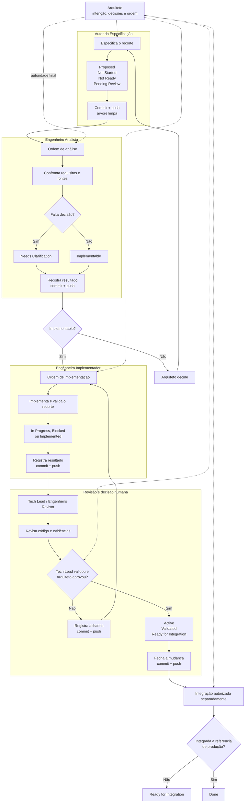

# Protocolo experimental — perfis EKM referenciados

**Modelo EKM aplicável:** 1.10

**Versão do protocolo:** 0.2

**Estado:** concluído; incorporado à EKM 1.11

## 1. Hipótese

Uma ordem curta pode dirigir uma etapa EKM quando o `AGENTS.md` do projeto
roteia o papel recebido para um núcleo comum e um perfil fixo na EKM.

Essa modalidade procura reduzir geração e repetição de prompts sem exigir que o
agente carregue a metodologia completa ou regras de outros papéis.

## 2. Ordem mínima

Exemplo:

```text
Atue como Engenheiro Implementador na especificação
docs/specs/GARAGE-CONTROL-STATE.md.
```

A ordem pode acrescentar um sub-recorte ou exceção explícita. Ela não precisa
repetir as regras já contidas no perfil.

## 3. Resolução pelo `AGENTS.md`

Antes de agir, o agente deve ler:

1. `AGENTS.md` do projeto;
2. `roles/REGRAS-COMUNS.md`;
3. exatamente um perfil correspondente ao papel recebido;
4. a especificação indicada;
5. apenas as fontes técnicas relacionadas ao recorte.

O agente não lê perfis de outros papéis nem a metodologia completa.

Mapeamento inicial:

| Papel recebido | Perfil |
|---|---|
| Autor da Especificação | `roles/AUTOR-DA-ESPECIFICACAO.md` |
| Engenheiro Analista | `roles/ENGENHEIRO-ANALISTA.md` |
| Engenheiro Implementador | `roles/ENGENHEIRO-IMPLEMENTADOR.md` |
| Engenheiro Revisor | `roles/ENGENHEIRO-REVISOR.md` |

## 4. Responsabilidade das fontes

- A EKM mantém regras comuns e responsabilidades do papel.
- O projeto mantém invariantes técnicas no `AGENTS.md`.
- A especificação mantém comportamento, limites e aceite.
- A ordem do Arquiteto seleciona papel, tarefa e recorte.

O perfil não deve absorver arquitetura específica de um projeto, e o
`AGENTS.md` não deve duplicar todos os perfis.

## 5. Responsabilidade pela passagem

Cada ator encerra a própria etapa:

1. executa somente a responsabilidade do perfil recebido;
2. atualiza a especificação e o conhecimento materialmente afetado;
3. promove somente os estados sustentados pelas evidências da etapa;
4. cria commit, realiza push e termina com árvore limpa.

Não existe um ator adicional destinado apenas a reconciliar ou versionar o
resultado dos demais. Quando Tech Lead e Arquiteto já tiverem validado e
aprovado o resultado, o Engenheiro Revisor registra essa evidência recebida,
promove `Active / Validated / Ready for Integration` e fecha a transação
aplicável. Ele não substitui nem repete a decisão humana.



## 6. Acesso à EKM

O `AGENTS.md` deve apontar para um caminho da EKM acessível ao ambiente do
agente. No experimento local, pode ser um caminho absoluto.

Se o ambiente não puder acessar a fonte:

- não inicie a atuação;
- informe a limitação;
- não substitua o perfil por conhecimento lembrado ou inferido.

Distribuição, cópia controlada ou empacotamento dos perfis permanecem decisões
de adoção de cada ambiente e não são definidos por este protocolo.

## 7. Modalidades preservadas

A modalidade referenciada não substitui o prompt autocontido já experimentado:

- **autocontida:** todas as regras pertinentes são entregues na invocação;
- **referenciada:** a invocação seleciona arquivos fixos por meio do
  `AGENTS.md`.

Ambas usam a mesma especificação, autoridade humana, estados e contrato Git.

## 8. Avaliação

Cada experimento deve observar somente o necessário para comparar as
modalidades:

- aderência ao papel, à especificação e ao escopo;
- consumo disponível de tokens ou créditos;
- intervenções e retrabalho;
- resultado funcional e limitações reais.

## 9. Limites

- seguir referências continua dependendo da capacidade do agente e do ambiente;
- caminhos locais podem não existir em containers ou serviços remotos;
- perfis fixos podem ficar incompatíveis com uma versão do projeto se a adoção
  não for deliberada;
- o protocolo não garante aderência universal;
- a execução permanece sequencial e não introduz controle de concorrência.

## 10. Resultado

A modalidade foi exercida durante o ciclo completo da especificação
`AIOTSMARTHOME-MODULE-SETTINGS-RESET-001@0.1`. O resultado funcional foi
validado no dispositivo final e integrado à `main`.

O Arquiteto aprovou sua incorporação à EKM 1.11. Este documento permanece como
registro do protocolo 0.2; as regras vigentes estão em `docs/EKM-METHOD.md` e
nos perfis oficiais de `roles/`.
