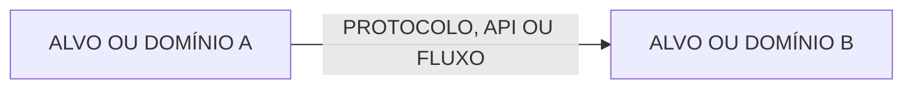

# EKOM — Mapa da Fonte Única da Verdade

**Classe da fonte:** Normativa

**Estado da fonte:** Vigente

O mapa localiza autoridade, estrutura e relações sem duplicar contratos
detalhados. A tabela responde onde está a fonte; a árvore, como o domínio se
organiza; o diagrama, como elementos separados se conectam.

## 1. Governança

| Área | Fonte | Tipo | Estado |
|---|---|---|---|
| Instruções para agentes | `AGENTS.md` | Normativo | Active |
| Diretrizes EKOM | `<REFERÊNCIA EXTERNA OU docs/rfc/EKOM-GUIDELINES.md>` | Normativo | Active |
| Mapa de conhecimento | `docs/rfc/KNOWLEDGE-MAP.md` | Normativo | Active |
| Histórico EKOM | `docs/rfc/EKOM-CHANGELOG.md` | Operacional | Active |
| Visão do sistema | `docs/specs/SYSTEM-DOSSIER.md` | `<CLASSIFICAÇÃO>` | `<ESTADO>` |

## 2. Índice de domínios e autoridade

| Domínio | Fonte normativa | Estado do workflow | Código principal | Evidência | Cobertura |
|---|---|---|---|---|---|
| `<DOMÍNIO>` | `<ESPECIFICAÇÃO OU GAP>` | `<RASCUNHO E ANÁLISE/PRONTA/IMPLEMENTAÇÃO/VALIDAÇÃO/CONCLUÍDA>` | `<CAMINHOS>` | `<TESTES/BUILD/AMBIENTE REAL>` | `<NÍVEL>` |

## 3. Árvore de conhecimento

A árvore é obrigatória quando contenção, composição ou responsabilidade for
material: mais de um runtime target, aplicativo, serviço ou firmware, ou três
ou mais domínios/componentes relacionados. Caso contrário, registre `Não se
aplica` e a justificativa.

```text
<REPOSITÓRIO OU SISTEMA>
├── <ALVO, DOMÍNIO OU APLICAÇÃO>
│   ├── <RESPONSABILIDADE OU COMPONENTE>
│   └── <RESPONSABILIDADE OU COMPONENTE>
└── <ALVO, DOMÍNIO OU APLICAÇÃO>
    └── <RESPONSABILIDADE OU COMPONENTE>
```

Use a menor árvore capaz de orientar localização. Não liste cada arquivo nem
repita requisitos das especificações.

## 4. Diagrama de relações

O diagrama Mermaid é obrigatório quando alvos implantáveis separadamente se
conectarem por protocolo, API, evento ou dados, ou quando um fluxo cruzar três
ou mais fronteiras. Caso contrário, registre `Não se aplica` e a justificativa.



Mantenha o diagrama pequeno e estável. Detalhes comportamentais pertencem às
fontes apontadas pelo índice.

## 5. Lacunas

| ID | Estado | Lacuna | Critério de encerramento | Dependência |
|---|---|---|---|---|
| `EKOM-GAP-0001` | `Open` | `<DESCRIÇÃO>` | `<EVIDÊNCIA OBJETIVA>` | `<DECISÃO OU TAREFA>` |

## 6. Manutenção

**Namespace de transações e lacunas:** `EKOM` | `EKM` legado

Atualize este mapa quando uma especificação, fonte relacionada, autoridade,
responsabilidade, evidência, estado ou lacuna mudar. Cada domínio deve apontar
para uma especificação como autoridade normativa; não remova entrada sem indicar
o destino do conhecimento.

Reconcilie também a árvore quando contenção ou responsabilidade mudar e o
diagrama quando surgir, desaparecer ou mudar uma relação material entre alvos.

Somente o Arquiteto determina Concluída ou Reaberta. Estados mais granulares
podem permanecer na especificação quando necessários, sem transferir essa
autoridade.
